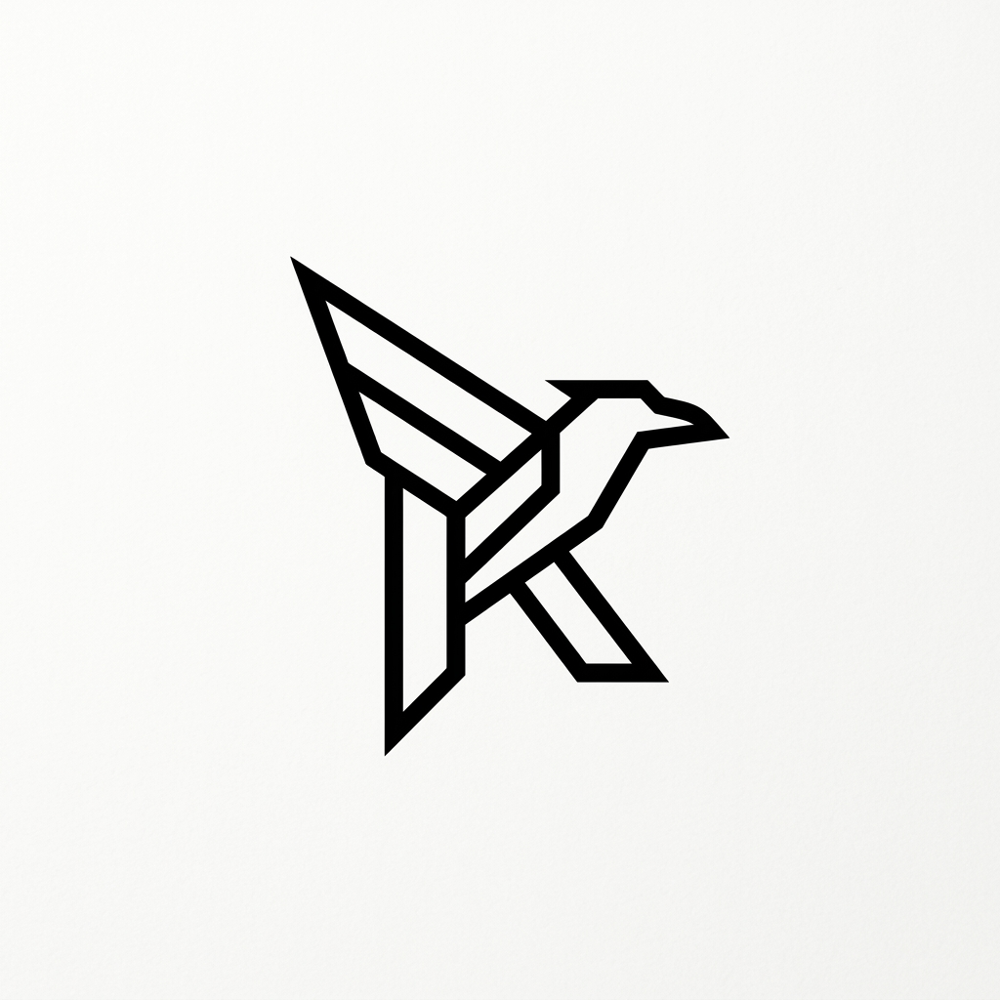

# RAVN UI



The design core for **Elite SaaS**. 

RAVN UI is a strictly designed, high-performance, and CDN-first UI library inspired by the precision of Linear and the flexibility of shadcn/ui. Built for developers who prioritize clarity, scale, and zero-configuration speed.

## Key Features
- **Elite Aesthetic**: High-fidelity design tokens, Inter typography, and a 4px precision spacing scale.
- **CDN-First**: No build tools, no npm installation required. Just copy-paste and build.
- **Modular Architecture**: Source files are split into logical modules (Tokens, Base, Components, Utilities).
- **Premium Themes**: Includes professional themes inspired by Supabase, Linear, and Claude.
- **Functional Documentation**: Built-in interactive search, scroll-sync, and one-click code copying.

## Quickstart

### Via CDN (Recommended)
Add the following to your `<head>`:

```html
<!-- Core Styles -->
<link rel="stylesheet" href="https://unpkg.com/@ravn-ui/core@1.0.0/dist/ui.css">
<link rel="stylesheet" href="https://unpkg.com/@ravn-ui/core@1.0.0/dist/themes.css">

<!-- Core Logic -->
<script src="https://unpkg.com/@ravn-ui/core@1.0.0/dist/ui.js"></script>
```

### Via Package Manager
```bash
# Using Bun
bun add @ravn-ui/core

# Using NPM
npm install @ravn-ui/core
```

## Modular Usage
If you prefer to use the modular source files:
```css
@import "@ravn-ui/core/src/css/tokens.css";
@import "@ravn-ui/core/src/css/base.css";
@import "@ravn-ui/core/src/css/components.css";
```

## Documentation
Run a local server and open `index.html` to explore the full interactive documentation and component playground.

---
RAVN UI &copy; 2026. Built for those who build the future.
